# 화면

커밋 메시지에는 그림을 넣을 수 없어서, 화면 변경은 이 문서에 모읍니다.
그림은 `docs/screenshots/`에 함께 커밋되어 있으므로 GitHub에서 바로 보입니다.

---

## 새 대화 — 대문

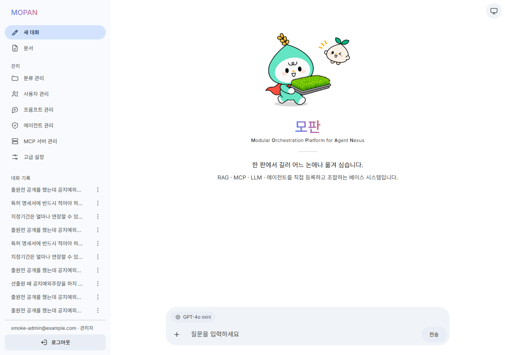

마스코트가 들고 있는 것이 **모판**입니다. 한 판에서 모를 길러 어느 논에나 옮겨 심는
그 모판이고, 제품 이름이 거기서 왔습니다. 영문으로는
**M**odular **O**rchestration **P**latform for **A**gent **N**exus로 읽습니다.

이전에는 이 자리에 예시 질문 네 개가 칩으로 놓여 있었는데 지웠습니다. 사용자가
자기 문서를 올려놓고 쓰는 화면에서, 그 문서와 아무 상관 없는 예시는 자리만
차지합니다.

브랜드 그라디언트는 이름 두 글자에만 걸었습니다. 이전에는 문장 하나가 통째로
그라디언트였는데, 본문 색으로 쓰기에는 과하고 390px에서는 한글이 단어 중간에서
줄바꿈되는 문제도 같이 있었습니다. 이름은 어느 너비에서도 줄바꿈되지 않습니다.

| 라이트 | 다크 |
|---|---|
| 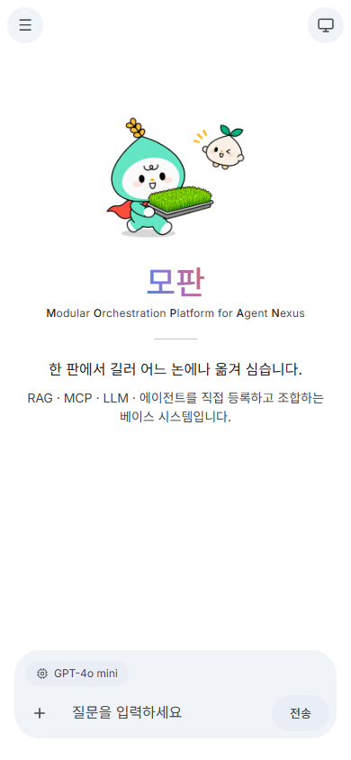 | 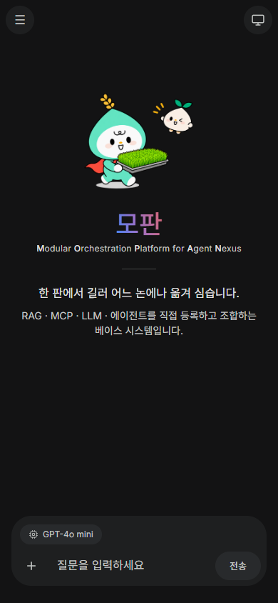 |

---

## 입력창 — 기능을 `+` 안으로

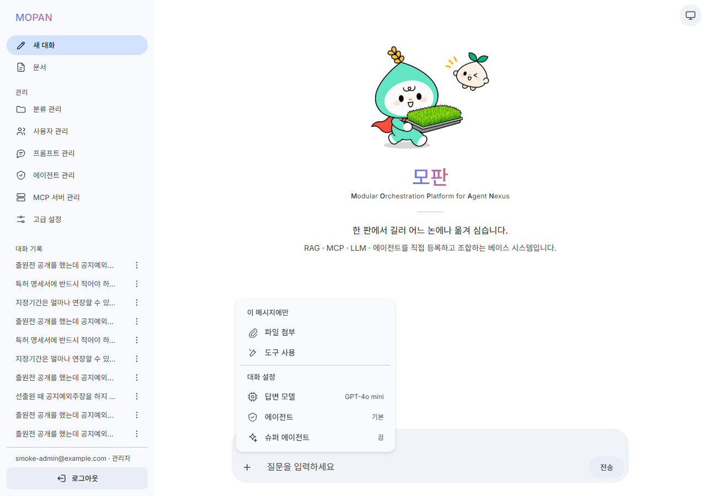

파일 첨부·도구·모델·에이전트·슈퍼 에이전트가 입력창 한 줄에서 자리를 다투고
있었습니다. 전부 `+` 메뉴로 넣고 두 묶음으로 갈랐습니다.

- **이 메시지에만** — 파일 첨부, 도구 사용. 이번 질문에만 붙는 것들입니다.
- **대화 설정** — 답변 모델, 에이전트, 슈퍼 에이전트. 다음 질문에도 계속 적용됩니다.

이 구분은 장식이 아닙니다. 첨부한 파일은 보내고 나면 끝이지만 모델을 바꾸면
계속 그 모델이 답합니다. 한 줄에 섞여 있을 때는 그 차이가 보이지 않았습니다.

### 상태는 숨기지 않았습니다

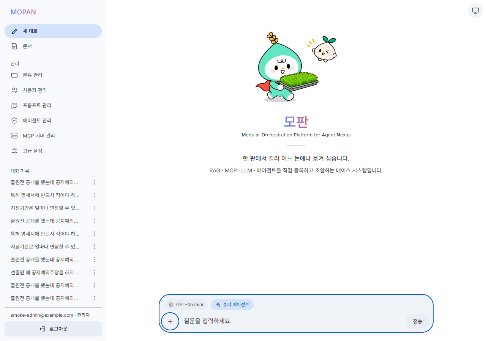

메뉴는 상태를 감춥니다. 그런데 "지금 어느 모델이 답하는지", "슈퍼 에이전트가
켜져 있는지"는 **보내기 전에** 알아야 하는 정보입니다. 메뉴 안의 값으로만 두면
메뉴를 열어야 알 수 있습니다.

그래서 기본값이 아닌 것만 입력창 **위**에 칩으로 남겼습니다. 옆이 아니라 위인
이유는 390px에서 기존 컨트롤 줄이 358px 중 260px를 쓰고 있었기 때문입니다.
전체 너비를 쓰는 줄은 아무것도 밀어내지 않습니다. 칩을 누르면 그 값을 바꾸는
시트가 열립니다.

---

## 사이드바 — 기능 아이콘

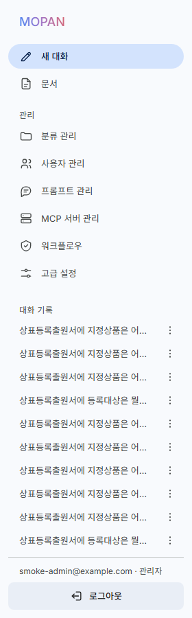

각 항목 왼쪽에 그 기능을 나타내는 기호를 넣었습니다. 인라인 SVG이고 아이콘
라이브러리를 추가하지 않았습니다 — 글리프 열두 개 때문에 의존성을 하나 더 지는
것은 남는 장사가 아닙니다.

**대화 기록에는 아이콘이 없습니다.** 그 줄들은 기능이 아니라 제목입니다. 같은
그림이 스무 줄 내려가면 아무것도 구별해주지 못하면서, 이미 말줄임되고 있는
224px짜리 줄에서 32px를 더 가져갑니다.

아이콘은 보이는 글자 옆의 장식이므로 `aria-hidden`이고, 스크린리더가 읽는
이름에는 들어가지 않습니다. 가장 긴 `MCP 서버 관리`가 280px에서 잘리지 않는 것을
실측했습니다.

---

## 모바일

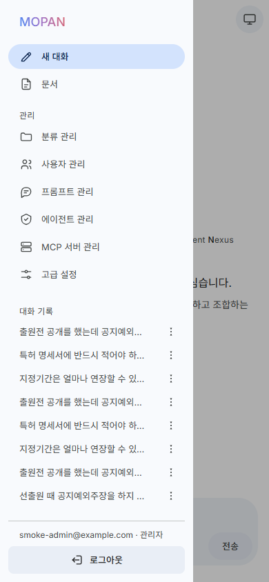

드로어는 열릴 때 포커스를 안으로 옮기고, Tab이 밖으로 새지 않으며, Escape로
닫으면 열었던 버튼으로 포커스가 돌아갑니다. 390px에서 가로 스크롤은 없습니다.

`+` 메뉴는 모바일에서 아래에서 올라오는 시트로 뜹니다.

한 가지 감수한 점: `+`를 누르면 메뉴가 모달이라 자판이 내려갑니다. 직접 실행되던
동작을 메뉴로 바꾸면 피할 수 없는 대가입니다. 파일 선택을 마치거나 취소하면
입력창으로 포커스가 돌아옵니다.

---

## 에이전트 생성 — 폼에서 캔버스로 (Slice 4·5. **지금은 없는 화면입니다**)

> **이 절은 기록입니다.** Slice 6에서 `에이전트`는 `워크플로우`로 이름이 바뀌었고
> `/agents` 화면은 없어졌습니다(`/workflows`로 넘어갑니다). 아래 내용 중
> **"선을 잇는 자리는 일부러 두지 않았습니다"는 이제 사실이 아닙니다** — 그 자리를
> 만든 것이 이번 슬라이스입니다. 지금 화면은 [워크플로우](#워크플로우--캔버스가-곧-화면입니다)를
> 보세요. 이 절을 지우지 않고 남겨 두는 이유는, 당시 판단과 그 판단이 왜 뒤집혔는지가
> 함께 남아야 다음 사람이 같은 것을 두 번 고민하지 않기 때문입니다.

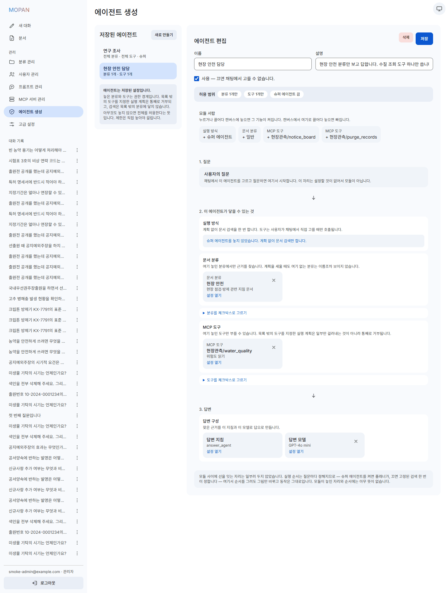

이 화면은 이름 한 칸, 드롭다운 두 개, 체크박스 목록 두 개짜리 폼이었습니다. 저장하는
내용은 그대로 두고 보는 방법만 바꿨습니다. API도 스키마도 손대지 않았습니다.

바꾼 이유는 하나입니다. **에이전트에서 중요한 것은 권한 경계인데, 체크박스 목록은
경계를 보여주기에 가장 나쁜 방법입니다.** 스무 개짜리 목록에서 두 개 켠 모습과 스무 개
다 켠 모습은 한눈에 구별되지 않습니다. 캔버스에 카드 두 장이 놓여 있고 도구 자리가
비어 있는 모습은 구별됩니다.

모듈은 다섯 가지이고, 하나하나가 저장되는 `agents` 한 줄의 필드 또는 연결 행입니다.

| 모듈 | 엔진에서 읽는 곳 |
|---|---|
| 문서 분류 | `agent_collections` → 검색이 닿을 수 있는 분류 |
| MCP 도구 | `agent_tools` → 부를 수 있는 도구 |
| 답변 지침 | `agents.prompt_name` |
| 답변 모델 | `agents.answer_model` |
| 슈퍼 에이전트 | `agents.orchestrator` |

### ~~선을 잇는 자리는 일부러 두지 않았습니다~~ (Slice 6에서 뒤집힘)

> 아래 문단이 걸었던 조건은 *"관리자가 그린 순서를 읽는 코드는 없다"* 였습니다.
> Slice 6에서 실행기가 간선을 읽기 시작했으므로 조건이 사라졌고, 화면의 그 문단도
> 함께 지웠습니다.

OpenAI의 에이전트 빌더는 선이 실행 순서를 정하는 그래프입니다. **MOPAN은 사용자가 그린
그래프를 실행하지 않습니다.** 슈퍼 에이전트를 켜면 질문을 받은 뒤 플래너가 단계와 그
의존 관계를 정하고, 끄면 고정된 검색 한 번입니다. 어느 쪽이든 관리자가 그린 순서를
읽는 코드는 없습니다.

그래서 선을 그리게 만들면, 모듈 두 개의 순서를 바꿔도 답이 그대로인 순간 이 화면 전체가
믿을 수 없는 그림이 됩니다. 대신 질문 → 닿을 수 있는 것 → 답변, 세 단계를 고정해 두고
그 사이에 화살표만 두었습니다. 이 화살표는 `retrieve()` 다음에 `answer()`가 오는 실제
순서이고, 옮기거나 지울 수 있는 것이 아닙니다. 캔버스 맨 아래에 그 사실을 한 문단으로
적어 두었습니다.

모듈의 좌표도 저장하지 않습니다. `agents` 테이블에 좌표를 넣을 자리가 없고, 스키마는
바꾸지 않기로 했기 때문입니다. 저장하면 사라질 위치를 끌고 다니게 하는 것은 죽은 선을
그리는 것과 같은 거짓말이라, 자유 배치 자체를 넣지 않았습니다.

### 비어 있으면 "전체 허용"이라고 크게 씁니다

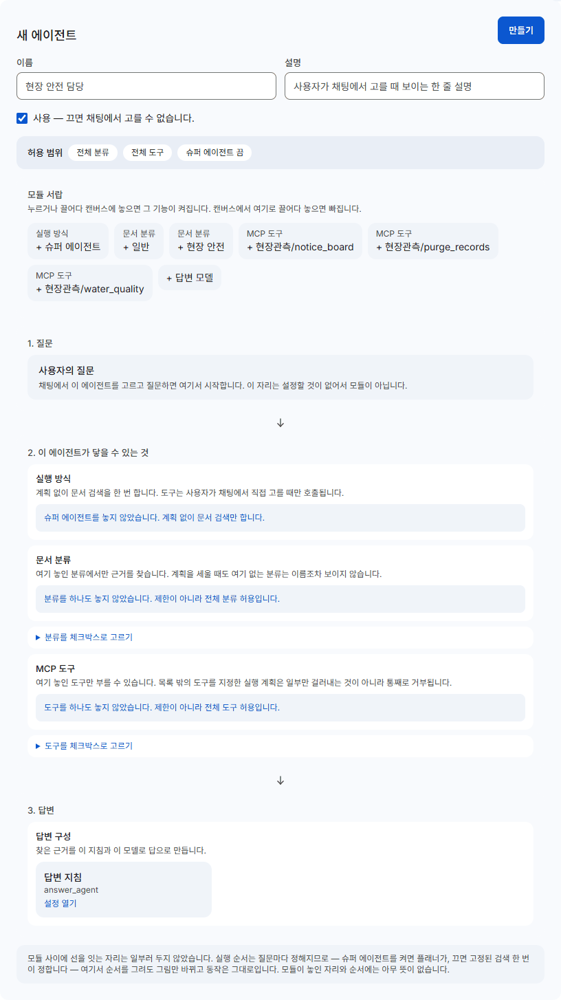

분류와 도구는 **아무것도 고르지 않으면 전체 허용**입니다. 이것이 이 화면에서 사람을
속일 수 있는 유일한 지점입니다. 캔버스에서 빈 자리는 "아무것도 못 준 상태"처럼 보이는데
실제로는 정반대이기 때문입니다.

그래서 빈 묶음은 비워 두지 않고, 자리를 채운 카드가 "제한이 아니라 전체 분류
허용입니다"라고 말합니다. 위쪽 **허용 범위** 줄에도 `전체 분류`, `분류 1개만`처럼
같은 사실이 한 줄로 나옵니다.

### 모듈 하나를 누르면 그 모듈만 설정합니다

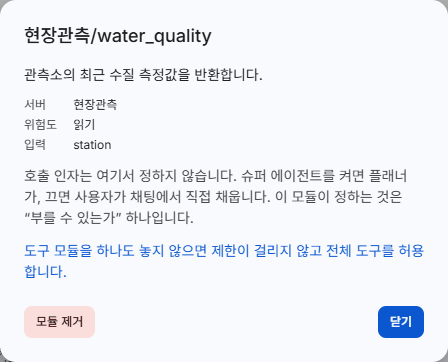

도구 모듈을 열면 서버, 위험도, 이 도구가 받는 입력이 보입니다. 예전 화면에서는 이름만
보고 체크해야 했습니다. 인자를 여기서 정하지는 않는다는 것도 적어 두었습니다 — 슈퍼
에이전트를 켜면 플래너가, 끄면 사용자가 채팅에서 직접 채웁니다. 이 모듈이 정하는 것은
"부를 수 있는가" 하나뿐입니다.

### 끌어다 놓기는 거들 뿐입니다

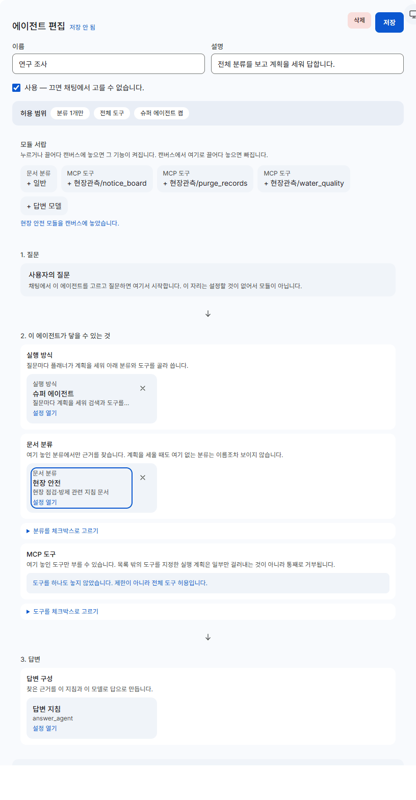

모든 모듈은 버튼입니다. Enter로 놓고, Enter로 설정을 열고, 제거 버튼으로 뺍니다.
모듈을 놓으면 서랍의 버튼이 사라지므로, 포커스는 방금 놓인 카드로 옮겨 갑니다. 뺄 때는
반대로 다시 넣을 수 있는 서랍 버튼으로 돌아옵니다. 에이전트 하나를 처음부터 끝까지
키보드만으로 만들고 저장하는 것을 실제로 돌려 확인했습니다.

분류와 도구 묶음 아래에는 **체크박스로 고르기**가 접혀 있습니다. 예전 방식이 사라지지
않도록 남긴 것이고, 캔버스 카드와 같은 함수를 부르므로 둘이 어긋날 수 없습니다.

### 경계가 실제로 막는지 확인했습니다

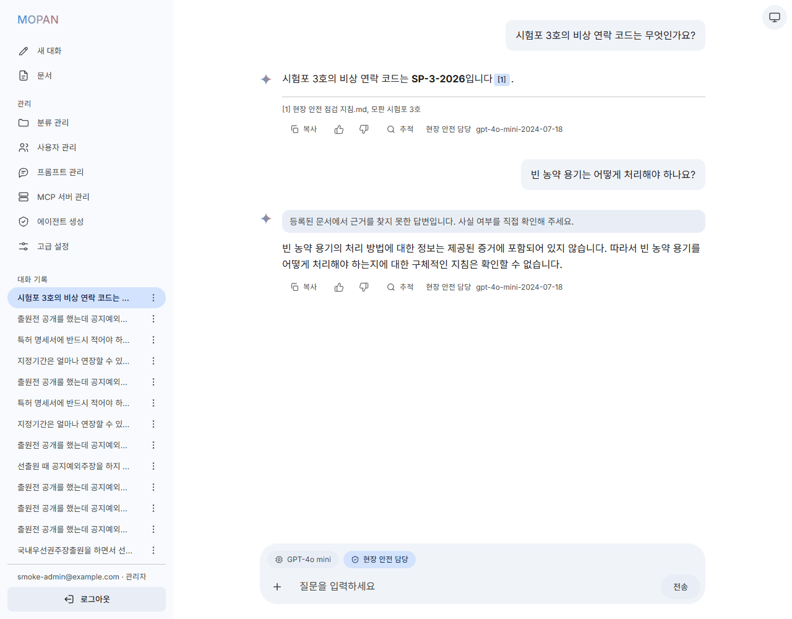

`현장 안전` 분류 하나와 읽기 도구 하나만 놓은 에이전트로 두 가지를 물었습니다.

- 자기 분류 안의 질문 — 답하고 근거를 답니다.
- 자기 분류 **밖**의 질문(빈 농약 용기 처리, 이 내용은 `일반` 분류에만 있습니다) —
  "등록된 문서에서 근거를 찾지 못한 답변입니다"가 뜨고 인용이 하나도 붙지 않습니다.

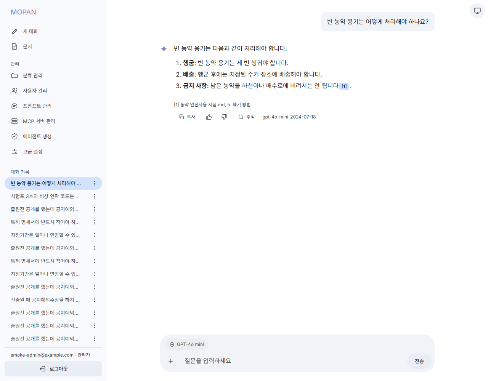

같은 질문을 에이전트 없이 물으면 `농약 안전사용 지침.md`를 인용해 그대로 답합니다.
문서가 없어서 못 답한 것이 아니라 경계가 막은 것입니다.

### 390px

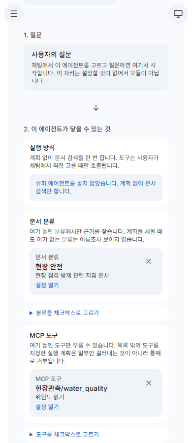

세 단계가 위에서 아래로 쌓이고 모듈 카드는 한 장씩 폭을 채웁니다. 가로 스크롤은 없고
잘리는 한글도 없습니다. 확대·이동하는 도화지가 아니라 카드와 버튼이라서 좁은 화면에서
따로 망가질 곳이 없습니다. 손가락으로 끌어 옮기는 것은 불편하지만, 끌기는 어디서도
유일한 방법이 아닙니다.

---

## 워크플로우 — 캔버스가 곧 화면입니다

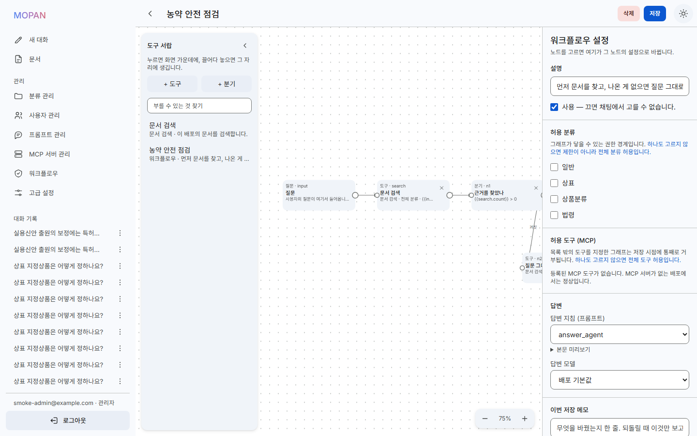

목록(`/workflows`)과 편집기(`/workflows/{id}`)를 나눴습니다. 첫 편집기는 긴 폼 안에
220px짜리 캔버스 띠가 끼어 있고 간선은 캔버스 아래 드롭다운 카드에서 만들었습니다 —
"캔버스는 작은데 도구가 방을 가득 채운" 화면이었고, 그 지적이 이 재구성의 이유입니다.
지금은 반대입니다. **캔버스가 화면 전체**이고, 폼은 전부 오른쪽 인스펙터에, 도구는
접히는 왼쪽 서랍에 삽니다.

- **도구 서랍** — `+ 도구`·`+ 분기`와 부를 수 있는 것(문서 검색·MCP·워크플로우)의
  목록. 누르면 화면 가운데에, 끌어다 놓으면 그 자리에 노드가 생깁니다. 접으면 버튼
  하나로 줄어들고, 390px에서는 접힌 채로 시작합니다.
- **인스펙터** — 아무것도 안 고르면 워크플로우 설정(설명·허용 경계·프롬프트·모델·
  버전), 노드를 고르면 그 노드의 설정, 간선을 고르면 그 간선의 조건. 예전의 모달
  설정 창과 두 번째 캔버스(권한 경계 모듈 캔버스)가 전부 이 패널 하나로 접혔습니다.
  빈 허용 목록이 "제한 없음"이라는 문장은 그대로 각 목록 옆에 적혀 있습니다.
- **팬·줌** — 빈 바닥을 끌면 이동, Ctrl+휠로 커서 기준 확대·축소, 오른쪽 아래 %
  버튼으로 화면 맞추기. 처음 열릴 때 한 번 그래프를 맞추고, 그 뒤에는 사람이 잡은
  시점을 존중합니다. 좁은 화면에서 통째로 맞추면 카드가 읽을 수 없게 작아지므로
  (실측 44%), 그때는 75%로 흐름의 시작을 왼쪽에 앵커합니다.

그래프 라이브러리는 이번에도 쓰지 않았습니다. 팬·줌과 포트 끌어 잇기가 이제 진짜
필요해졌지만, 그 값은 여기서 ~120줄이고 react-flow는 의존성 5개짜리 앱에 ~50KB입니다.
절대 배치한 카드와 `<svg>` 경로라는 뼈대는 그대로입니다.

### 간선은 포트를 끌어 잇습니다 — 키보드로도 똑같이 됩니다

노드 오른쪽의 포트를 끌면 점선 미리보기가 따라오고, 대상 카드 위에서 놓으면
간선이 됩니다. 분기에서 나가는 간선의 조건은 자동으로 채워집니다 — 참이 비어 있으면
참, 아니면 거짓. 두 간선을 그리는 동안 조건을 한 번도 고르지 않아도 맞는 그래프가
됩니다.

**같은 간선을 키보드로도 만들 수 있습니다.** 노드를 고르면 인스펙터의 `나가는 간선`
절에 대상 드롭다운과 `잇기` 버튼이 있습니다 — 첫 편집기의 키보드 1급 경로 약속은
그대로이고, 자리만 캔버스 밖으로 옮겨졌습니다. 노드는 여전히 버튼입니다: Enter로
설정, 방향키로 이동(Shift는 다섯 칸), Delete로 삭제.

### 노드를 고르면 인스펙터가 그 노드가 됩니다

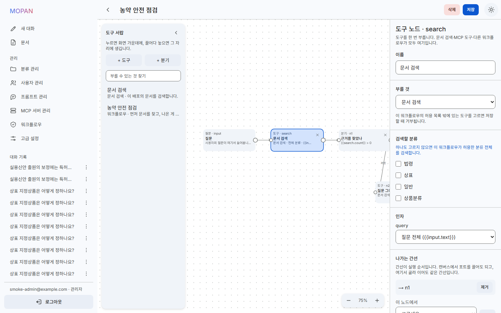

**참조는 값 전체여야 합니다.** `"제목: {{n1.top.title}}"` 같은 문자열 끼워 넣기는
저장 시점에 거부됩니다 — 그 값의 대부분을 제3자 서버가 쓴 문자열이 차지하게 되기
때문입니다. 그래서 인자 칸은 자유 입력이 아니라 **먼저 실행되는 노드의 값 목록**에서
고르는 드롭다운이고, 직접 입력을 고르면 그때 글자를 칩니다.

목록에 나오는 것은 **이 노드보다 확실히 먼저 실행되는 노드**뿐입니다. 서버는 위상
정렬에서 앞서기만 하면 허용하지만, 그중에는 분기의 반대쪽 가지처럼 *실행되지 않을 수도
있는* 노드가 섞입니다. 그런 참조는 언젠가 질문 하나에서 터지므로 아예 권하지 않습니다.

조건은 `값 비교`(`== != > >= < <=`), `값이 있음`, `값이 비어 있음`, `and`, `or`,
`not`입니다. **모델이 판단하는 분기(`kind: llm`)는 목록에 없습니다.** 스키마에는 자리가
있지만 서버가 저장 시점에 거부하고, 분기마다 모델을 부르는 비용은 소유자가 값을 보고
켜는 것이 맞기 때문입니다. 인스펙터에 그 사실이 한 문단으로 적혀 있습니다.

### 저장 계약은 그대로입니다

저장 버튼은 상단 바에 하나입니다. 새 워크플로우는 설정과 그래프를 **한 요청**으로
보내 실행 불가 상태로 저장되는 일이 없게 하고, 저장된 워크플로우는 설정을 PATCH로,
그래프를 **새 버전**으로 보냅니다 — 그래프 저장은 전부 버전이고, 되돌리기는 옛 버전을
다시 활성으로 만들 뿐 기록을 지우지 않습니다. 버전 목록과 `이번 저장 메모`는
인스펙터의 워크플로우 패널에 있습니다.

서버의 거부는 **그것이 가리키는 노드 카드나 간선 위에** 그대로 붙습니다. 문구는 서버가
쓴 그대로이고 화면은 자리만 정합니다. 순환은 깊이 우선 탐색으로 순환을 닫은 간선을
찾아 붙이고, 그래프 전체에 대한 거부만 상단 배너로 남습니다. 저장이 거절되면 문제의
노드가 자동으로 선택되어 인스펙터에도 같은 문장이 뜹니다.

저장하지 않고 목록으로 돌아가려 하면 확인 창이 묻고, 탭을 닫으려 하면 브라우저가
묻습니다.

### 390px

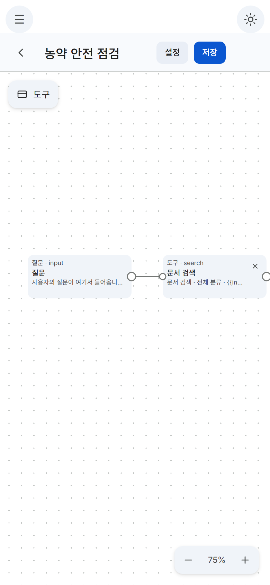

캔버스는 그대로 화면 전체입니다. 서랍은 `도구` 버튼으로 접혀서 시작하고, 인스펙터는
상단 바의 `설정` 버튼으로 여닫는 오버레이가 됩니다. 노드 끌기와 포트 잇기는 포인터
이벤트라 터치로도 같은 동작입니다.

---

## 입력창의 `@` — 부를 수 있는 것 하나의 목록

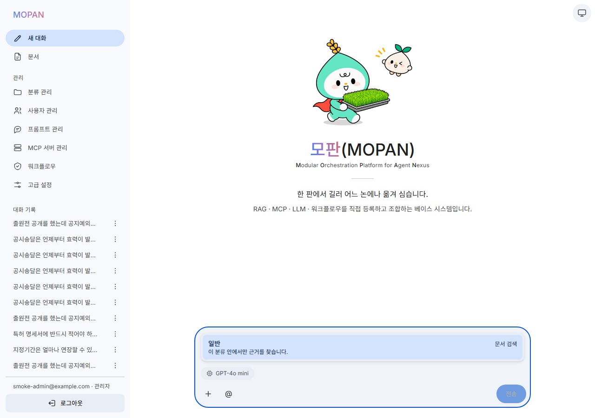

`@`를 치면 **부를 수 있는 것이 한 목록으로** 뜹니다. 문서 분류, MCP 도구, 저장된
워크플로우가 같은 줄에 섞여 있는 것은 셋이 같은 `Tool` 인터페이스이기 때문입니다.
전송을 담당하는 기술(HTTP냐 프로세스 안이냐)로 목록을 나누면, 사용자에게 MCP가
무엇인지 알아야 고를 수 있게 만드는 셈입니다.

- `@`만 치면 전체, 뒤에 글자를 이으면 이름으로 좁힙니다.
- 고르면 입력창에서 `@…` 글자는 사라지고 **칩**이 됩니다. 글자를 남겨 두면 그것이
  질문의 일부로 모델에게 갑니다.
- 위·아래 방향키로 고르고 Enter로 넣습니다. 목록은 모달이 아니라 입력창의 팝업이라
  (`role="combobox"` + `aria-activedescendant`) 포커스가 질문에서 떠나지 않고,
  휴대폰에서 자판도 내려가지 않습니다.

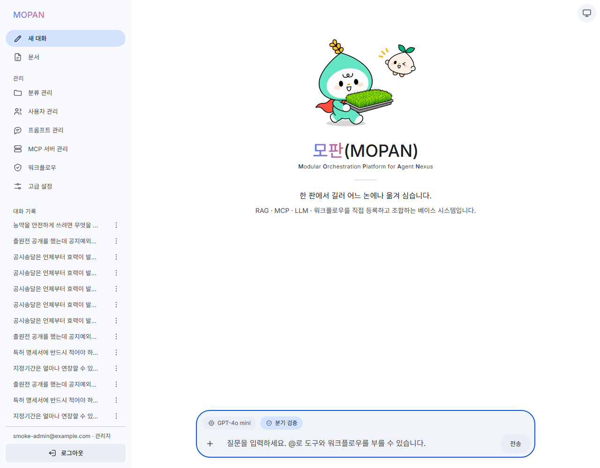

390px에서도 같은 목록입니다. 목록 높이는 `40vh`로 잡았습니다 — 자판이 올라온 휴대폰의
보이는 높이가 340px 남짓이라, 고정 픽셀로 잡으면 목록이 자기를 띄운 입력창을 덮습니다.

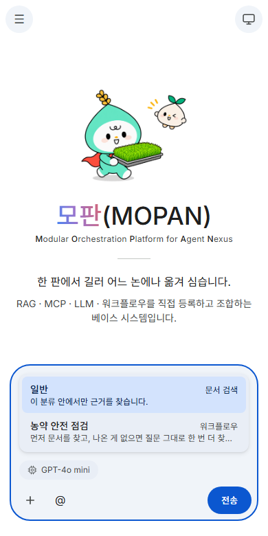

### 한글을 조합하는 중에는 열리지 않습니다

조합 중에 목록이 열리면 다음 키 입력을 목록이 가로채서 **글자가 먹힙니다.** 그래서
목록은 조합 중에 **열리지 않고**, 조합이 끝나는 순간(`compositionend`) 다시 확인해서
그때 엽니다. 이미 열려 있는 목록은 조합 중에도 계속 좁혀집니다 — 그건 가로채는 것이
아니라 걸러 보여주는 것뿐이고, Enter는 어차피 같은 신호로 막혀 있습니다.

쓰는 신호는 **Enter 전송을 막을 때 쓰던 것과 같은 세 가지**입니다(`isComposing`,
`keyCode === 229`, 조합 이벤트로 세우는 ref). 목록 전용으로 네 번째를 만들면 브라우저
하나에서 두 동작이 어긋납니다.

크롬 개발자 프로토콜의 IME 입력으로 실제로 확인했습니다. 조합 중에는 목록이 열리지
않고, `@` 뒤에 `일`을 조합해도 글자가 그대로 들어가며, 그 상태에서 Enter를 눌러도
질문이 전송되지 않고 목록에서 아무것도 골라지지 않습니다.

### 지워진 것을 고른 채로 보내면 거절당합니다

칩이 화면에 남아 있다는 것이 그것이 아직 있다는 뜻은 아닙니다. 고른 뒤 관리자가 그
워크플로우를 지웠거나 중지시켰다면, 전송할 때 서버가
`워크플로우를 찾을 수 없습니다.` (404) 또는
`사용이 중지된 워크플로우입니다. 관리자에게 문의해 주세요.` (409)로 거절하고 그 문장이
그대로 뜹니다. 대화가 만들어지기 **전에** 거절되므로 제목만 있고 답이 없는 대화가
남지 않습니다.

### 실행이 추적에 그대로 남습니다

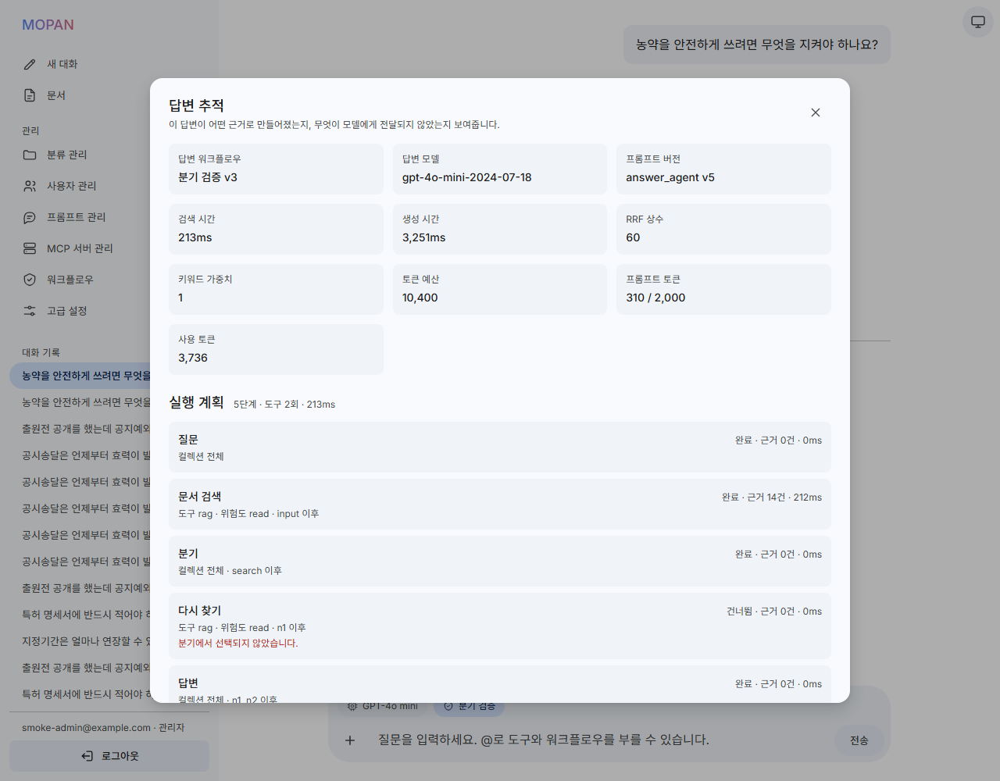

`@`로 고른 워크플로우로 실제 질문을 하나 보내고 추적을 열었습니다. 노드 다섯 개가 순서
대로 있고, 분기가 참으로 가면서 `질문 그대로 다시 찾기`가 **건너뜀 · 분기에서 선택되지
않았습니다**로 남습니다. 간선이 실행을 정한다는 말이 화면에서 확인되는 자리입니다.

`실행 계획` 옆의 `사람이 만든 절차`가 이 그래프를 누가 썼는지입니다. 슈퍼 에이전트가
그 자리에서 만든 그래프도 **같은 실행기**를 지나고 같은 모양으로 이 자리에 남으며,
다른 것은 그 한 줄뿐입니다.

---

## 관리 화면 — 넓은 모니터

전 화면을 390px와 데스크톱 기본 폭에서 확인해 왔는데, **1920·2560을 아무도 본 적이
없었습니다.** 화면 폭을 넓혀 두고 헤드리스 크롬으로 전 관리 화면을 다시 재 봤습니다.

### 1024px 기둥 하나가 화면 한가운데에 서 있었습니다

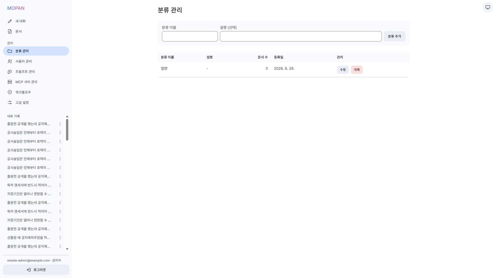

`mx-auto max-w-5xl space-y-6 px-4 py-6 sm:px-6`. 이 한 줄이 관리 화면 **여덟 곳에
그대로 복사돼** 있었습니다(분류·사용자·프롬프트·MCP·고급 설정·문서·문서 상세, 그리고
워크플로우만 이유 없이 `max-w-7xl`). 1024px 기둥이 1640px짜리 `main` 안에 가운데로
서니 양옆에 308px씩 빈자리가 남고, 사이드바와 제목 사이가 335px 벌어집니다. 2560에서는
화면의 40%만 내용이었습니다.

여덟 개를 각각 고치면 다음번에 또 여덟 갈래로 갈라집니다. **하나로 합쳤습니다** —
`components/layout/PageShell.tsx`. 폭은 `max-w-7xl`(1280px, 워크플로우가 이미 쓰던
값이라 그래프 편집기는 쓰던 자리를 그대로 지킵니다)이고, 1536px부터
`max-w-page`(1600px)로 한 번 넓어집니다. 1280 미만에서는 `max-w`가 애초에 걸리지
않으므로 **390px 화면은 픽셀 하나 바뀌지 않았습니다.**

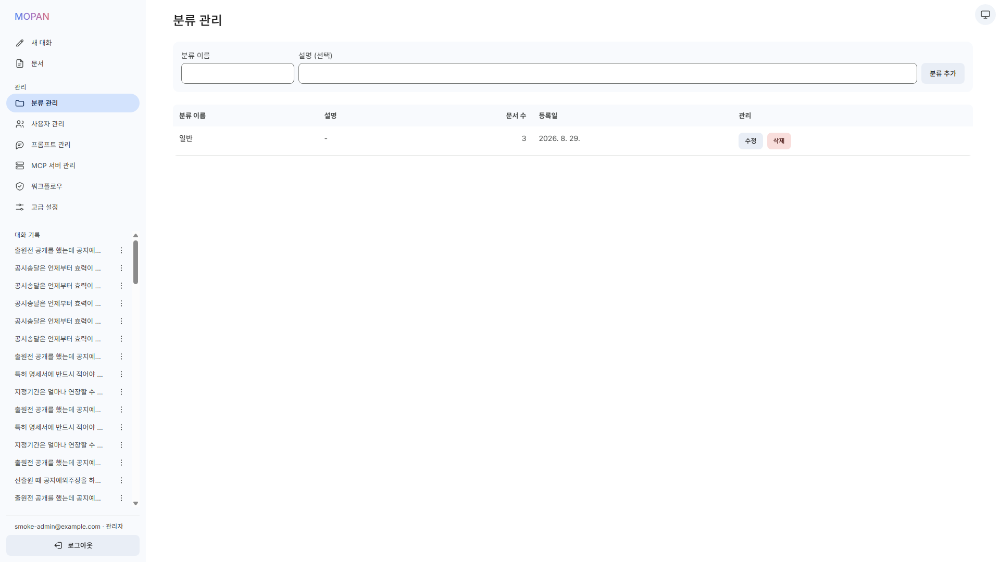

| 화면 폭 | 내용 기둥 (전) | 내용 기둥 (후) | 화면 채움 |
|---|---|---|---|
| 1280 | 1000 | 1000 | 78% → 78% |
| 1440 | 1024 | 1160 | 71% → 81% |
| 1920 | 1024 | 1600 | 53% → 83% |
| 2560 | 1024 | 1600 | 40% → 63% |

2560에서 63%에 멈추는 것은 일부러입니다. 한 줄이 화면 끝까지 늘어나면 눈이 다음 줄
첫 글자를 못 찾습니다. 넓은 화면에서 여백은 버려지는 자리가 아니라 **글줄 길이를
지키는 자리**입니다.

### 아래가 비는 것과, 카드 안이 비는 것은 다른 문제입니다

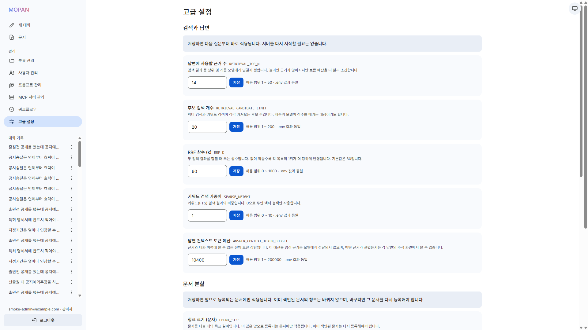

내용이 짧으면 긴 화면 아래가 남습니다. 그건 정상이고, 억지로 채울 일이 아닙니다.
문제는 다른 쪽이었습니다 — 고급 설정은 카드 하나에 제목·한 문장·32자짜리 입력칸·저장
버튼만 들어 있는데 그 카드를 975px로 늘려 놓고 한 줄에 하나씩 쌓았습니다. **카드
안쪽 3분의 2가 비어 있고**, 그래서 1080px 화면에서 페이지 높이가 2011px이 됐습니다.

1536px부터 두 칸 격자로 놓았습니다. 폭을 늘어난 컨트롤 하나에 쓰지 않고 **줄 수를
줄이는 데** 씁니다.

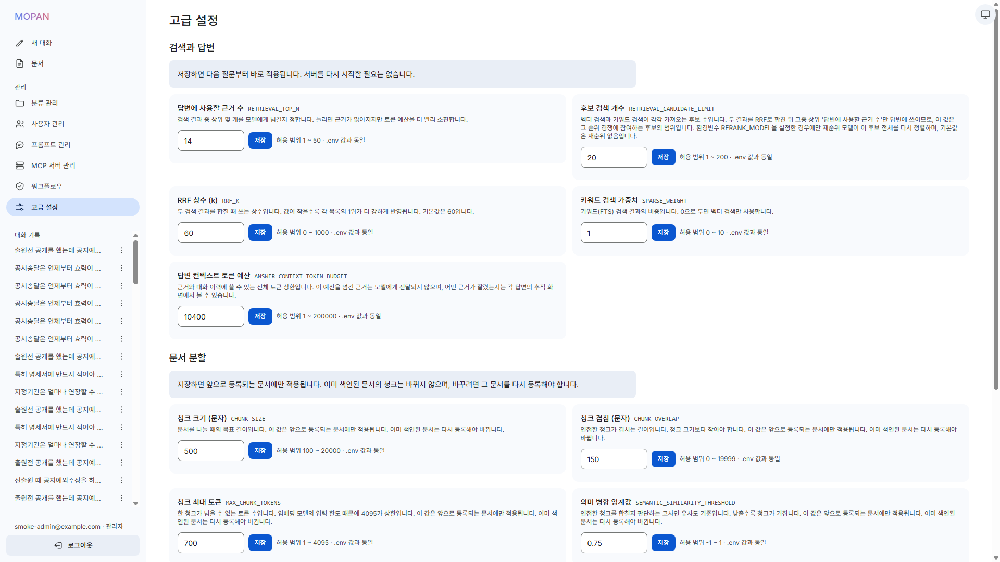

1920px 기준 페이지 높이 **2011px → 1394px**. 탭 순서는 DOM 순서 그대로라 격자가
읽히는 순서(왼→오른, 위→아래)와 어긋나지 않습니다 — 1920과 2560에서 관리 화면 전부의
포커스 순서를 다시 재서 어긋난 자리가 0인 것을 확인했습니다.

### `v3 사용...`으로 잘려 보이던 버튼

버튼 클래스 넷(`.btn-filled/.btn-tonal/.btn-text/.btn-danger`)은 높이가 고정입니다
(40px, `.btn-compact`면 32px). 그런데 줄바꿈을 막아 두지 않아서, 표의 관리 칸이 좁아지면
`v4 사용하기`가 두 줄로 접히고 **둘째 줄이 버튼 밖으로 나갔습니다.** 화면에서는 글자
아랫동강이 잘린 것으로 보입니다. 재 보면 `scrollHeight 40`에 `clientHeight 32` —
/prompts 390px에서 여덟 개가 한꺼번에 그랬습니다.

네 클래스에 `whitespace-nowrap`을 넣었습니다. 접히지 않으니 표가 제 폭을 요구하게 되고,
그제서야 감싸고 있던 `overflow-x-auto`가 **줄어들지 않고 스크롤합니다.** 전 화면
390~2560 전 폭에서 자기 상자를 넘치는 컨트롤 **0개**입니다.

### 한글은 아무 데서나 끊깁니다

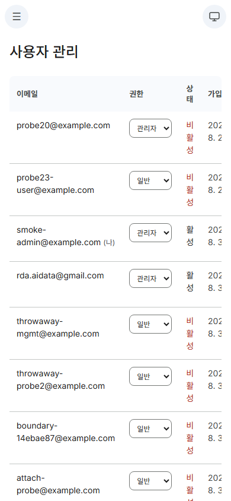
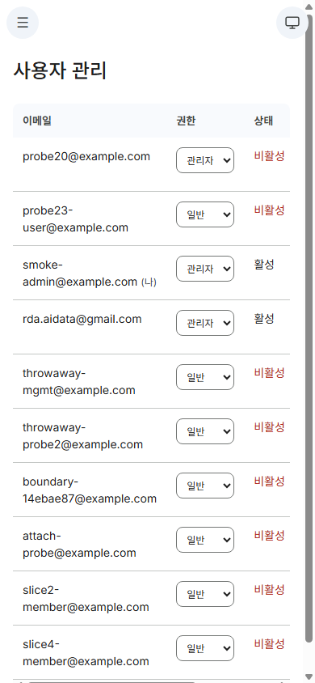

`비활성`이 비/활/성으로 세로로 쌓였습니다. 한글은 음절 사이에 띄어쓰기가 없어서
`word-break: normal`이면 **어느 음절 뒤에서든 줄이 바뀝니다.** 그러면 표 자동
레이아웃이 보는 그 칸의 최소 폭은 **글자 한 개**가 되고, 상태 칸에 12픽셀을 줍니다.

표에 `break-keep`(`word-break: keep-all`)을 걸었습니다. 낱말이 단위가 되니 칸이 제 폭을
요구하고, 넘치면 표가 자기 상자 안에서 옆으로 스크롤합니다. 390px 사용자 관리 페이지
높이 **1085px → 879px**. 긴 토큰(이메일, 파일명)은 원래 쓰던 `break-all`/`truncate`가
그 자리에서 이깁니다.

### 표는 페이지를 밀지 않습니다

다섯 화면이 `overflow-x-auto rounded-sm` + `w-full text-left text-body` 두 줄을 각자
적어 두고 있었고, MCP 도구 표만 감싸개를 빠뜨리고 있었습니다. `components/ui/DataTable.tsx`
하나로 합쳤습니다. `caption`은 `sr-only`로 들어갑니다 — 표 위의 `<h2>`는 표의 이름이
아닙니다.

관리 화면 일곱 개 × 390/640/768/1024/1280/1440/1536/1920/2560 아홉 폭 = **63자리에서
`document.scrollWidth - clientWidth`가 전부 0입니다.** 넓은 표는 자기 상자 안에서만
움직입니다. `app/(app)/layout.tsx`의 `overflow-y-auto`가 `main`의 자동 최소 크기를
0으로 만든다는 그 주석은 **맞았습니다** — 고치기 전에도 페이지 가로 스크롤은 0이었고,
잘려 보이던 것은 표가 페이지를 민 게 아니라 버튼과 한글이 자기 칸 안에서 접힌 것이었
습니다.

### 남은 것

- **768~1024px**에서는 사이드바 280px을 빼고 나면 본문이 458~744px밖에 안 됩니다.
  문서·프롬프트 표는 이 구간에서 여전히 옆으로 스크롤해야 마지막 칸이 보입니다. 표는
  자기 상자 안에서 움직이고 잘린 글자도 없지만, 이 구간에서 사이드바를 접을지는 손대지
  않았습니다.
- **워크플로우 그래프 편집기**는 노드를 절대 위치로 놓기 때문에 DOM 순서와 보이는
  순서가 원래부터 어긋납니다(390px에서도 똑같이 어긋납니다). 이번에 건드리지 않았습니다.

---

## 문서 삭제 — 확인 창이 문서 이름과 청크 수를 말합니다

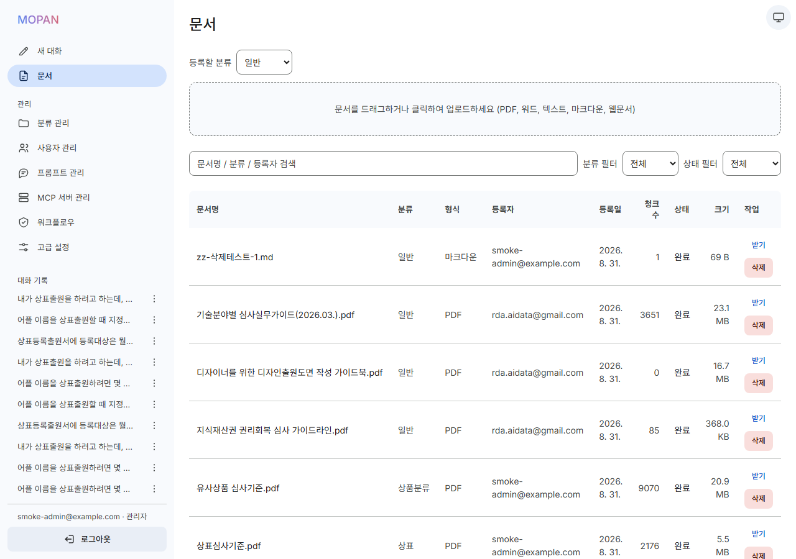

`DELETE /api/documents/{id}`는 처음부터 있었지만 화면에서 부르는 곳이 없었습니다. 그동안
문서를 지우려면 API를 직접 두드려야 했고, 실제로 그러다 지우면 안 될 문서를 지운 적이
있습니다. 표의 마지막 칸(`원본` → `작업`)에 `삭제`를 붙였습니다.

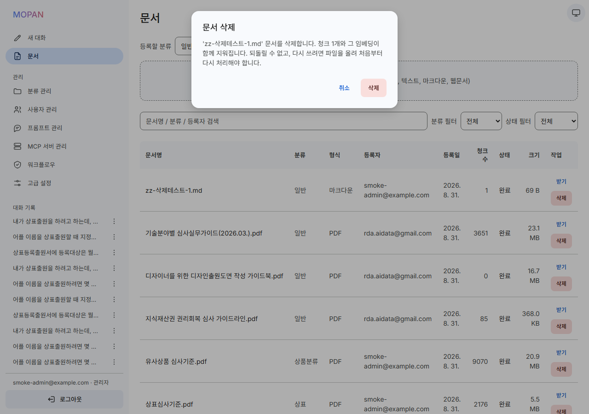

확인 창은 **`정말 삭제할까요?`라고 묻지 않습니다.** 문서 이름과 청크 수를 그대로 읽어
줍니다 — 여덟 줄이 똑같이 생긴 표에서 잘못 누른 손을 잡아 주는 건 그 두 가지뿐입니다.
지워지는 임베딩은 돈과 시간으로 만든 것이라(유사상품 심사기준 한 건이 약 $0.03에 몇
분입니다) 되돌릴 수 없다는 것과 다시 올려 처음부터 처리해야 한다는 것도 같이 씁니다.

아직 처리 중인 문서에는 한 줄이 더 붙습니다 — `지금 임베딩 중 상태이므로 진행 중인
처리도 함께 버려집니다.` 빈말이 아닙니다. 삭제는 워커의 arq 작업을 **취소하지 않습니다.**
워커는 임베딩까지 다 만든 뒤에야 사라진 행을 향해 쓰다가 외래키 위반으로 끝납니다(고아
청크는 남지 않습니다 — `ON DELETE CASCADE`와 그 외래키가 막습니다). 즉 이미 쓴 임베딩
비용은 돌려받지 못합니다.

한 번에 한 건입니다. `실패한 문서 모두 삭제` 같은 편의 기능은 넣지 않았습니다.

### 지운 뒤에는 목록을 다시 받아옵니다

행을 배열에서 빼내는 대신 `GET /api/documents`를 다시 부릅니다. 행이 사라진 것은
서버가 그렇다고 할 때뿐입니다. 확인 창 자체는 `분류 관리`가 쓰던 `ui/ConfirmDialog`
그대로입니다 — 네이티브 `<dialog>` + `showModal()`이라 포커스 가둠·Escape·배경 비활성이
공짜로 따라옵니다.

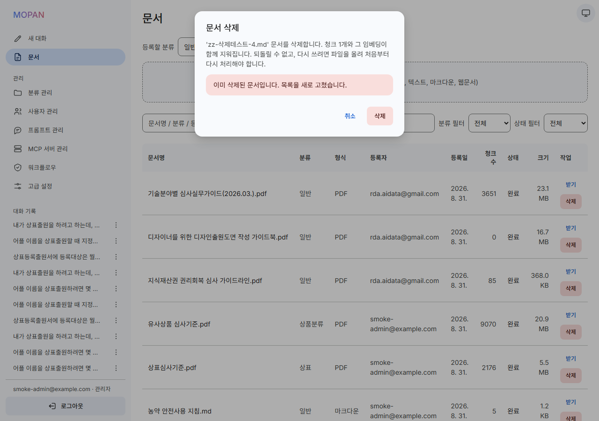

**다른 세션이 먼저 지운 문서**를 지우려 하면 API가 404를 줍니다. 백엔드의
`문서를 찾을 수 없습니다.`를 그대로 보여 주면 삭제가 실패한 것처럼 읽히므로,
`이미 삭제된 문서입니다. 목록을 새로 고쳤습니다.`로 바꿔 창 안에 띄우고 목록을 다시
받아옵니다. 창을 닫으면 유령 행은 이미 없습니다.

### 키보드만으로 끝까지

Tab으로 그 줄의 `삭제`까지 가고(사이드바 대화 기록을 지나 299번), Enter로 열고,
Escape로 닫으면 포커스가 **누른 버튼으로 돌아옵니다.** 창이 열려 있는 동안 Tab은
`취소` → `삭제` → 문서 → `취소`로 돕니다 — 뒤 페이지의 컨트롤로 새지 않습니다.

지운 뒤가 문제였습니다. 포커스를 돌려줄 그 버튼이 **방금 사라졌기 때문에** 네이티브
복원이 `<body>`에 떨어뜨리고, 다음 Tab이 페이지 맨 위에서 다시 시작합니다. 표 바로 위
검색 상자로 보냅니다 — 사라지지 않는 것 중 가장 가까운 자리입니다.

### 관리자에게만 보입니다

엔드포인트가 `require_admin`(관리자가 아니면 403)이므로 화면도 같은 줄을 긋습니다.
`user.role`이 `admin`이 아니면 `onDelete`를 아예 넘기지 않아 버튼이 그려지지 않습니다.
관리자가 아닌 눈으로 연 문서 화면: `삭제` **0개**, `받기` 8개.

### 390px

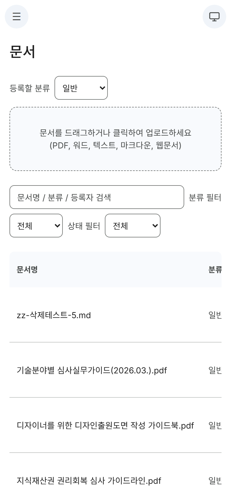
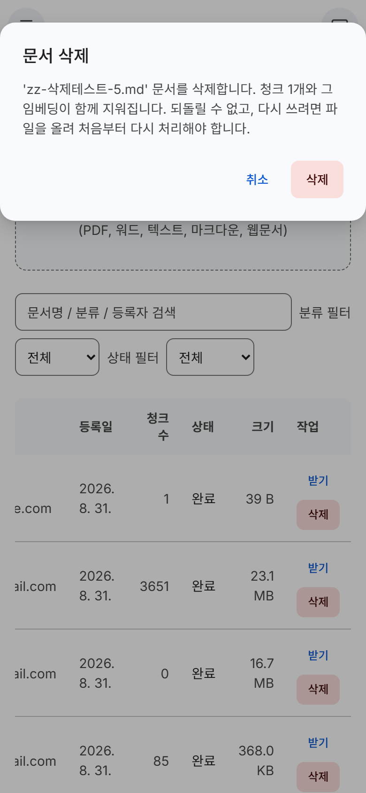

`작업` 칸의 두 버튼은 `flex-wrap`입니다. 이건 장식이 아니라 계산입니다 — 나란히 두면
이 칸의 최소 폭이 55px쯤 늘고, **1280px**에서 표가 자기 스크롤 상자를 46px 밀어내면서
`삭제`가 가로 스크롤 뒤로 숨었습니다. 접어 두면 최소 폭이 버튼 하나가 됩니다. 1280에서
위아래로 쌓이고 1440부터는 다시 한 줄입니다. `표 넘침 46px → 0px`(1280/1440/1920 전부
0), 390px 페이지 가로 넘침 0.

### 남은 것

- **삭제해도 워커 작업은 취소되지 않습니다.** 처리 중인 문서를 지우면 이미 시작된
  임베딩 요청은 끝까지 갔다가 버려집니다. arq 작업을 안전하게 끊는 일은 이 화면 하나가
  감당할 크기가 아니라 손대지 않았습니다. 대신 확인 창이 그렇게 된다고 말합니다.
- 로그에는 그때 외래키 위반 트레이스백이 임베딩 벡터를 통째로 붙여 한 번 찍힙니다.
  arq는 이 예외를 재시도하지 않으므로 한 번뿐이고, 데이터는 멀쩡합니다.
