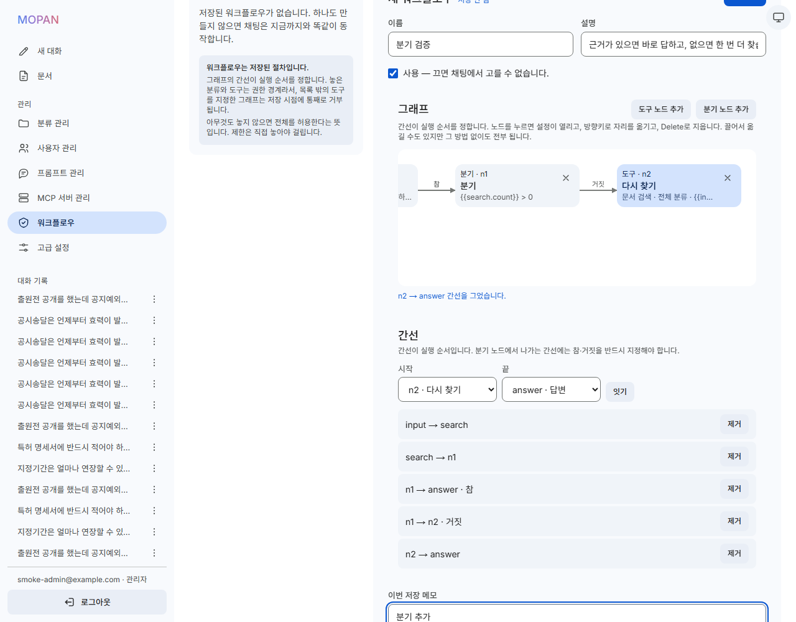
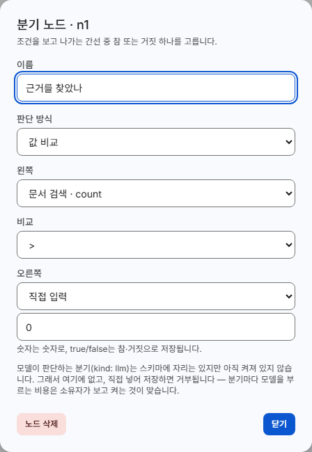
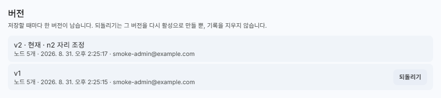
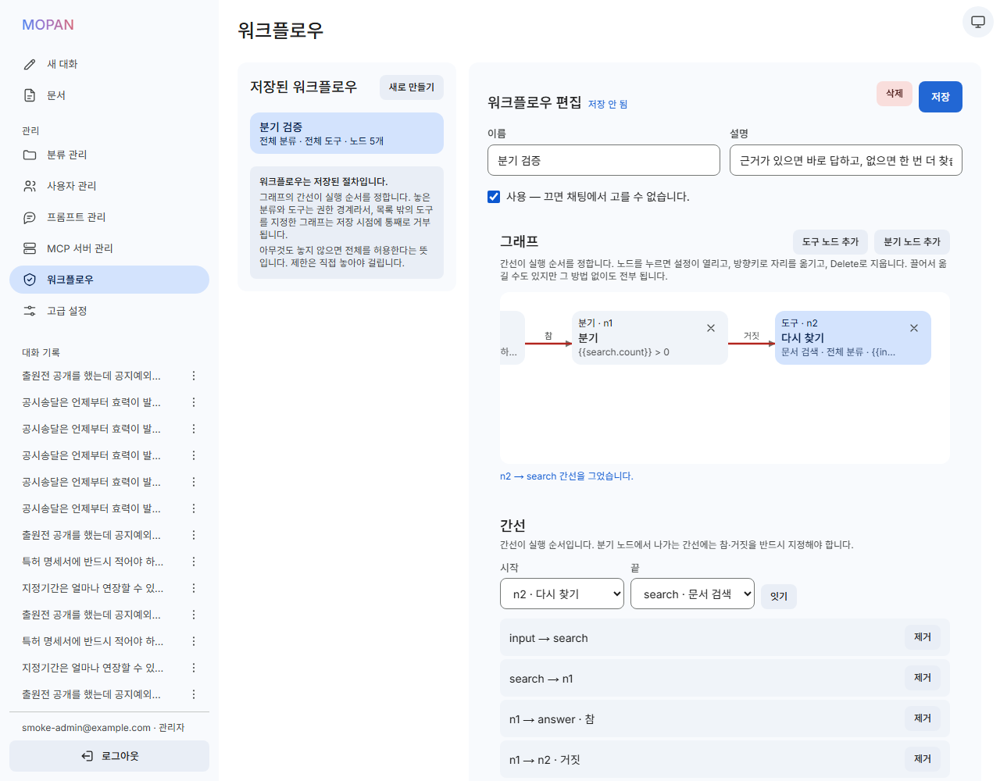
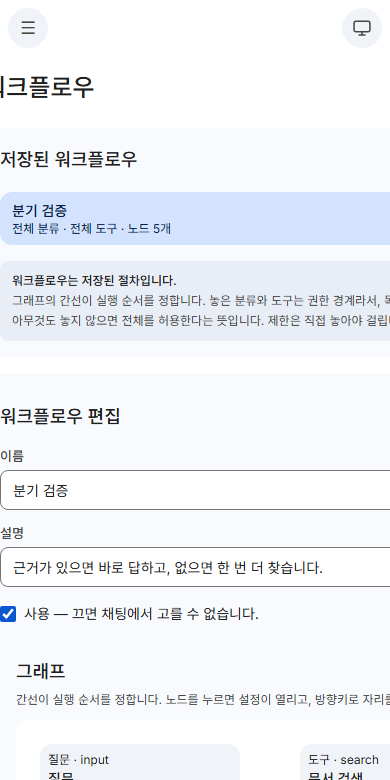

# 화면

커밋 메시지에는 그림을 넣을 수 없어서, 화면 변경은 이 문서에 모읍니다.
그림은 `docs/screenshots/`에 함께 커밋되어 있으므로 GitHub에서 바로 보입니다.

---

## 새 대화 — 대문

마스코트가 들고 있는 것이 **모판**입니다. 한 판에서 모를 길러 어느 논에나 옮겨 심는
그 모판이고, 제품 이름이 거기서 왔습니다. 영문으로는
**M**odular **O**rchestration **P**latform for **A**gent **N**exus로 읽습니다.

이전에는 이 자리에 예시 질문 네 개가 칩으로 놓여 있었는데 지웠습니다. 사용자가
자기 문서를 올려놓고 쓰는 화면에서, 그 문서와 아무 상관 없는 예시는 자리만
차지합니다.

브랜드 그라디언트는 이름 두 글자에만 걸었습니다. 이전에는 문장 하나가 통째로
그라디언트였는데, 본문 색으로 쓰기에는 과하고 390px에서는 한글이 단어 중간에서
줄바꿈되는 문제도 같이 있었습니다. 이름은 어느 너비에서도 줄바꿈되지 않습니다.

| 라이트 | 다크 |
|---|---|
|  |  |

---

## 입력창 — 기능을 `+` 안으로

파일 첨부·도구·모델·에이전트·슈퍼 에이전트가 입력창 한 줄에서 자리를 다투고
있었습니다. 전부 `+` 메뉴로 넣고 두 묶음으로 갈랐습니다.

- **이 메시지에만** — 파일 첨부, 도구 사용. 이번 질문에만 붙는 것들입니다.
- **대화 설정** — 답변 모델, 에이전트, 슈퍼 에이전트. 다음 질문에도 계속 적용됩니다.

이 구분은 장식이 아닙니다. 첨부한 파일은 보내고 나면 끝이지만 모델을 바꾸면
계속 그 모델이 답합니다. 한 줄에 섞여 있을 때는 그 차이가 보이지 않았습니다.

### 상태는 숨기지 않았습니다

메뉴는 상태를 감춥니다. 그런데 "지금 어느 모델이 답하는지", "슈퍼 에이전트가
켜져 있는지"는 **보내기 전에** 알아야 하는 정보입니다. 메뉴 안의 값으로만 두면
메뉴를 열어야 알 수 있습니다.

그래서 기본값이 아닌 것만 입력창 **위**에 칩으로 남겼습니다. 옆이 아니라 위인
이유는 390px에서 기존 컨트롤 줄이 358px 중 260px를 쓰고 있었기 때문입니다.
전체 너비를 쓰는 줄은 아무것도 밀어내지 않습니다. 칩을 누르면 그 값을 바꾸는
시트가 열립니다.

---

## 사이드바 — 기능 아이콘

각 항목 왼쪽에 그 기능을 나타내는 기호를 넣었습니다. 인라인 SVG이고 아이콘
라이브러리를 추가하지 않았습니다 — 글리프 열두 개 때문에 의존성을 하나 더 지는
것은 남는 장사가 아닙니다.

**대화 기록에는 아이콘이 없습니다.** 그 줄들은 기능이 아니라 제목입니다. 같은
그림이 스무 줄 내려가면 아무것도 구별해주지 못하면서, 이미 말줄임되고 있는
224px짜리 줄에서 32px를 더 가져갑니다.

아이콘은 보이는 글자 옆의 장식이므로 `aria-hidden`이고, 스크린리더가 읽는
이름에는 들어가지 않습니다. 가장 긴 `MCP 서버 관리`가 280px에서 잘리지 않는 것을
실측했습니다.

---

## 모바일

드로어는 열릴 때 포커스를 안으로 옮기고, Tab이 밖으로 새지 않으며, Escape로
닫으면 열었던 버튼으로 포커스가 돌아갑니다. 390px에서 가로 스크롤은 없습니다.

`+` 메뉴는 모바일에서 아래에서 올라오는 시트로 뜹니다.

한 가지 감수한 점: `+`를 누르면 메뉴가 모달이라 자판이 내려갑니다. 직접 실행되던
동작을 메뉴로 바꾸면 피할 수 없는 대가입니다. 파일 선택을 마치거나 취소하면
입력창으로 포커스가 돌아옵니다.

---

## 에이전트 생성 — 폼에서 캔버스로 (Slice 4·5. **지금은 없는 화면입니다**)

> **이 절은 기록입니다.** Slice 6에서 `에이전트`는 `워크플로우`로 이름이 바뀌었고
> `/agents` 화면은 없어졌습니다(`/workflows`로 넘어갑니다). 아래 내용 중
> **"선을 잇는 자리는 일부러 두지 않았습니다"는 이제 사실이 아닙니다** — 그 자리를
> 만든 것이 이번 슬라이스입니다. 지금 화면은 [워크플로우](#워크플로우--간선이-실행-순서를-정합니다)를
> 보세요. 이 절을 지우지 않고 남겨 두는 이유는, 당시 판단과 그 판단이 왜 뒤집혔는지가
> 함께 남아야 다음 사람이 같은 것을 두 번 고민하지 않기 때문입니다.

이 화면은 이름 한 칸, 드롭다운 두 개, 체크박스 목록 두 개짜리 폼이었습니다. 저장하는
내용은 그대로 두고 보는 방법만 바꿨습니다. API도 스키마도 손대지 않았습니다.

바꾼 이유는 하나입니다. **에이전트에서 중요한 것은 권한 경계인데, 체크박스 목록은
경계를 보여주기에 가장 나쁜 방법입니다.** 스무 개짜리 목록에서 두 개 켠 모습과 스무 개
다 켠 모습은 한눈에 구별되지 않습니다. 캔버스에 카드 두 장이 놓여 있고 도구 자리가
비어 있는 모습은 구별됩니다.

모듈은 다섯 가지이고, 하나하나가 저장되는 `agents` 한 줄의 필드 또는 연결 행입니다.

| 모듈 | 엔진에서 읽는 곳 |
|---|---|
| 문서 분류 | `agent_collections` → 검색이 닿을 수 있는 분류 |
| MCP 도구 | `agent_tools` → 부를 수 있는 도구 |
| 답변 지침 | `agents.prompt_name` |
| 답변 모델 | `agents.answer_model` |
| 슈퍼 에이전트 | `agents.orchestrator` |

### ~~선을 잇는 자리는 일부러 두지 않았습니다~~ (Slice 6에서 뒤집힘)

> 아래 문단이 걸었던 조건은 *"관리자가 그린 순서를 읽는 코드는 없다"* 였습니다.
> Slice 6에서 실행기가 간선을 읽기 시작했으므로 조건이 사라졌고, 화면의 그 문단도
> 함께 지웠습니다.

OpenAI의 에이전트 빌더는 선이 실행 순서를 정하는 그래프입니다. **MOPAN은 사용자가 그린
그래프를 실행하지 않습니다.** 슈퍼 에이전트를 켜면 질문을 받은 뒤 플래너가 단계와 그
의존 관계를 정하고, 끄면 고정된 검색 한 번입니다. 어느 쪽이든 관리자가 그린 순서를
읽는 코드는 없습니다.

그래서 선을 그리게 만들면, 모듈 두 개의 순서를 바꿔도 답이 그대로인 순간 이 화면 전체가
믿을 수 없는 그림이 됩니다. 대신 질문 → 닿을 수 있는 것 → 답변, 세 단계를 고정해 두고
그 사이에 화살표만 두었습니다. 이 화살표는 `retrieve()` 다음에 `answer()`가 오는 실제
순서이고, 옮기거나 지울 수 있는 것이 아닙니다. 캔버스 맨 아래에 그 사실을 한 문단으로
적어 두었습니다.

모듈의 좌표도 저장하지 않습니다. `agents` 테이블에 좌표를 넣을 자리가 없고, 스키마는
바꾸지 않기로 했기 때문입니다. 저장하면 사라질 위치를 끌고 다니게 하는 것은 죽은 선을
그리는 것과 같은 거짓말이라, 자유 배치 자체를 넣지 않았습니다.

### 비어 있으면 "전체 허용"이라고 크게 씁니다

분류와 도구는 **아무것도 고르지 않으면 전체 허용**입니다. 이것이 이 화면에서 사람을
속일 수 있는 유일한 지점입니다. 캔버스에서 빈 자리는 "아무것도 못 준 상태"처럼 보이는데
실제로는 정반대이기 때문입니다.

그래서 빈 묶음은 비워 두지 않고, 자리를 채운 카드가 "제한이 아니라 전체 분류
허용입니다"라고 말합니다. 위쪽 **허용 범위** 줄에도 `전체 분류`, `분류 1개만`처럼
같은 사실이 한 줄로 나옵니다.

### 모듈 하나를 누르면 그 모듈만 설정합니다

도구 모듈을 열면 서버, 위험도, 이 도구가 받는 입력이 보입니다. 예전 화면에서는 이름만
보고 체크해야 했습니다. 인자를 여기서 정하지는 않는다는 것도 적어 두었습니다 — 슈퍼
에이전트를 켜면 플래너가, 끄면 사용자가 채팅에서 직접 채웁니다. 이 모듈이 정하는 것은
"부를 수 있는가" 하나뿐입니다.

### 끌어다 놓기는 거들 뿐입니다

모든 모듈은 버튼입니다. Enter로 놓고, Enter로 설정을 열고, 제거 버튼으로 뺍니다.
모듈을 놓으면 서랍의 버튼이 사라지므로, 포커스는 방금 놓인 카드로 옮겨 갑니다. 뺄 때는
반대로 다시 넣을 수 있는 서랍 버튼으로 돌아옵니다. 에이전트 하나를 처음부터 끝까지
키보드만으로 만들고 저장하는 것을 실제로 돌려 확인했습니다.

분류와 도구 묶음 아래에는 **체크박스로 고르기**가 접혀 있습니다. 예전 방식이 사라지지
않도록 남긴 것이고, 캔버스 카드와 같은 함수를 부르므로 둘이 어긋날 수 없습니다.

### 경계가 실제로 막는지 확인했습니다

`현장 안전` 분류 하나와 읽기 도구 하나만 놓은 에이전트로 두 가지를 물었습니다.

- 자기 분류 안의 질문 — 답하고 근거를 답니다.
- 자기 분류 **밖**의 질문(빈 농약 용기 처리, 이 내용은 `일반` 분류에만 있습니다) —
  "등록된 문서에서 근거를 찾지 못한 답변입니다"가 뜨고 인용이 하나도 붙지 않습니다.

같은 질문을 에이전트 없이 물으면 `농약 안전사용 지침.md`를 인용해 그대로 답합니다.
문서가 없어서 못 답한 것이 아니라 경계가 막은 것입니다.

### 390px

세 단계가 위에서 아래로 쌓이고 모듈 카드는 한 장씩 폭을 채웁니다. 가로 스크롤은 없고
잘리는 한글도 없습니다. 확대·이동하는 도화지가 아니라 카드와 버튼이라서 좁은 화면에서
따로 망가질 곳이 없습니다. 손가락으로 끌어 옮기는 것은 불편하지만, 끌기는 어디서도
유일한 방법이 아닙니다.

---

## 워크플로우 — 간선이 실행 순서를 정합니다

`에이전트 생성`이 있던 자리입니다. 이름만 바뀐 것이 아닙니다.

- 경로가 `/agents` → `/workflows`로 옮겨졌습니다. 예전 주소는 새 주소로 넘겨줍니다
  (307). 저장해 둔 링크가 404가 되지 않게 하려는 것이고, 영구 리다이렉트(308)로 하지
  않은 이유는 브라우저가 그것을 사실상 영원히 캐시하기 때문입니다.
- **`agents.orchestrator` 컬럼이 없어졌습니다.** 저장된 절차가 자율 계획을 켜고 있던
  것이 층위를 섞은 원인이었습니다. 슈퍼 에이전트는 이제 입력창의 대화 단위 토글
  **하나뿐**이고, 이 화면에는 그 스위치가 없습니다.

### 그래프

노드는 네 가지입니다. `질문`과 `답변`은 그래프당 하나이고 지울 수 없습니다 — 그 둘이
없으면 실행할 수 없는데, 지울 수 있게 두면 *저장은 되는데 돌릴 수 없는* 워크플로우가
생깁니다. `도구` 노드는 문서 검색·MCP 도구·다른 워크플로우를 모두 부를 수 있고,
`분기` 노드는 조건을 보고 나가는 간선 중 참 또는 거짓 하나를 고릅니다.

**간선이 실행 순서입니다.** 위 그림에서 `{{search.count}} > 0`이 참이면 바로 답하고,
거짓이면 `질문 그대로 다시 찾기`를 한 번 더 지난 뒤 답합니다. 순서를 바꾸면 답이
실제로 바뀝니다. 노드 좌표도 저장되므로 다시 열었을 때 그림이 그대로입니다.

그래프 라이브러리는 쓰지 않았습니다. 런타임 의존성 5개짜리 앱에 react-flow를 넣으면
그리는 것보다 그리는 도구가 무거워지고, 그것이 사 오는 기능(확대·이동, 미니맵,
포트 끌어 잇기)은 여기서 필요한 것이 아닙니다. 절대 배치한 카드와 `<svg>` 선입니다.

### 노드 하나를 누르면 그 노드만 설정합니다

**참조는 값 전체여야 합니다.** `"제목: {{n1.top.title}}"` 같은 문자열 끼워 넣기는
저장 시점에 거부됩니다 — 그 값의 대부분을 제3자 서버가 쓴 문자열이 차지하게 되기
때문입니다. 그래서 인자 칸은 자유 입력이 아니라 **먼저 실행되는 노드의 값 목록**에서
고르는 드롭다운이고, 직접 입력을 고르면 그때 글자를 칩니다. 규칙을 설명하는 대신
어길 수 없게 만들었습니다.

목록에 나오는 것은 **이 노드보다 확실히 먼저 실행되는 노드**뿐입니다. 서버는 위상
정렬에서 앞서기만 하면 허용하지만, 그중에는 분기의 반대쪽 가지처럼 *실행되지 않을 수도
있는* 노드가 섞입니다. 그런 참조는 언젠가 질문 하나에서 터지므로 아예 권하지 않습니다.

조건은 `값 비교`(`== != > >= < <=`), `값이 있음`, `값이 비어 있음`, `and`, `or`,
`not`입니다. 여덟 가지 모양을 실제로 저장해서 전부 201을 받은 것만 목록에 넣었습니다.
**모델이 판단하는 분기(`kind: llm`)는 목록에 없습니다.** 스키마에는 자리가 있지만
서버가 저장 시점에 `모델 판단 분기(kind: llm)는 아직 켜져 있지 않습니다.`로 거부하고,
분기마다 모델을 부르는 비용은 소유자가 값을 보고 켜는 것이 맞기 때문입니다. 설정 창에
그 사실을 한 문단으로 적어 두었습니다.

### 저장할 때마다 한 버전이 남습니다

절차를 고치다 나빠지는 일은 반드시 생기고, 그때 필요한 것은 기억에 의존한 재입력이
아니라 **직전의 그 줄**입니다. 되돌리기는 옛 버전을 다시 활성으로 만들 뿐 기록을
지우지 않습니다. 그래서 답변에 `농약 안전 점검 v1`처럼 버전까지 남습니다 — 2주 전
답변은 그때의 그래프가 만든 것이지 오늘의 그래프가 만든 것이 아닙니다.

`이번 저장 메모` 칸은 **저장된 워크플로우에만** 나옵니다. 만들기(POST)에는 메모를 받는
자리가 없어서, 새로 만들 때 이 칸을 보여주면 적어도 사라지는 칸이 됩니다.

### 거부는 틀린 자리에 붙입니다

서버는 잘못된 그래프를 통째로 거부하고 한국어 문장을 돌려줍니다. 그 문장을 화면 맨 위
배너 하나에 몰아 넣으면, 노드가 열 개쯤 되는 순간 `분기 노드의 간선에는 참/거짓을
지정해야 합니다: b1`을 읽고 나서 `b1`이 그림의 어디인지를 사람이 다시 찾아야 합니다.
그래서 문장은 **그것이 가리키는 노드 카드나 간선 줄에** 붙습니다. 문구는 서버가 쓴
그대로이고, 화면은 자리만 정합니다.

순환은 특별한 경우입니다. 서버의 `그래프의 간선이 순환합니다.`에는 간선 이름이 없습니다
— 위상 정렬이 더 진행되지 않는 것으로 알아내므로 남은 간선이 모두 똑같이 의심스럽기
때문입니다. 화면은 깊이 우선 탐색으로 **스택에 아직 올라 있는 노드로 돌아가는 간선**을
찾아 거기에 붙입니다. 그 간선이 순환을 닫은 간선입니다.

전체에 대한 거부(`노드가 상한(20개)을 넘었습니다.` 같은)는 원래 그래프 전체가 문제이므로
배너로 남습니다.

### 끌기는 거들 뿐입니다

노드는 버튼입니다. Enter로 설정을 열고, 방향키로 옮기고(Shift와 함께 누르면 다섯 칸),
Delete로 지웁니다. 간선은 `시작`·`끝` 드롭다운과 `잇기` 버튼으로 만들고 목록의 `제거`로
지웁니다 — 포트를 끌어 잇는 방식은 포인터 없이는 아예 불가능해서 택하지 않았습니다.

키보드만으로 다음을 실제로 돌려 확인했습니다: 새로 만들기 → 이름 입력 → 분기 노드 추가
→ (포커스가 방금 놓인 노드로 따라옴) → 방향키로 이동 → Enter로 설정 → Escape로 닫고
포커스 복귀 → 드롭다운 두 개로 간선 추가 → Delete로 노드와 그 간선 삭제.

마우스로 끌어 옮기는 것도 됩니다. 처음에는 끌기를 마친 손을 떼는 순간 그것이 클릭으로
도 읽혀서 설정 창이 같이 열렸는데, 움직였는지를 기억해 두었다가 그 클릭을 무시하도록
고쳤습니다.

### 390px

그래프는 좁은 화면에서 **가로로 스크롤됩니다**. 접거나 세로로 쌓지 않았습니다 — 간선이
실행 순서인 그림에서 배치를 마음대로 바꾸면 그림이 다른 말을 하게 됩니다. 스크롤되는
것은 캔버스뿐이고 화면 전체가 밀리지 않습니다(처음에는 밀렸습니다. 그리드 칸이 캔버스
너비만큼 자라서 `main`이 통째로 가로 스크롤됐고, `min-w-0`으로 고쳤습니다).

---

## 입력창의 `@` — 부를 수 있는 것 하나의 목록

`@`를 치면 **부를 수 있는 것이 한 목록으로** 뜹니다. 문서 분류, MCP 도구, 저장된
워크플로우가 같은 줄에 섞여 있는 것은 셋이 같은 `Tool` 인터페이스이기 때문입니다.
전송을 담당하는 기술(HTTP냐 프로세스 안이냐)로 목록을 나누면, 사용자에게 MCP가
무엇인지 알아야 고를 수 있게 만드는 셈입니다.

- `@`만 치면 전체, 뒤에 글자를 이으면 이름으로 좁힙니다.
- 고르면 입력창에서 `@…` 글자는 사라지고 **칩**이 됩니다. 글자를 남겨 두면 그것이
  질문의 일부로 모델에게 갑니다.
- 위·아래 방향키로 고르고 Enter로 넣습니다. 목록은 모달이 아니라 입력창의 팝업이라
  (`role="combobox"` + `aria-activedescendant`) 포커스가 질문에서 떠나지 않고,
  휴대폰에서 자판도 내려가지 않습니다.

390px에서도 같은 목록입니다. 목록 높이는 `40vh`로 잡았습니다 — 자판이 올라온 휴대폰의
보이는 높이가 340px 남짓이라, 고정 픽셀로 잡으면 목록이 자기를 띄운 입력창을 덮습니다.

### 한글을 조합하는 중에는 열리지 않습니다

조합 중에 목록이 열리면 다음 키 입력을 목록이 가로채서 **글자가 먹힙니다.** 그래서
목록은 조합 중에 **열리지 않고**, 조합이 끝나는 순간(`compositionend`) 다시 확인해서
그때 엽니다. 이미 열려 있는 목록은 조합 중에도 계속 좁혀집니다 — 그건 가로채는 것이
아니라 걸러 보여주는 것뿐이고, Enter는 어차피 같은 신호로 막혀 있습니다.

쓰는 신호는 **Enter 전송을 막을 때 쓰던 것과 같은 세 가지**입니다(`isComposing`,
`keyCode === 229`, 조합 이벤트로 세우는 ref). 목록 전용으로 네 번째를 만들면 브라우저
하나에서 두 동작이 어긋납니다.

크롬 개발자 프로토콜의 IME 입력으로 실제로 확인했습니다. 조합 중에는 목록이 열리지
않고, `@` 뒤에 `일`을 조합해도 글자가 그대로 들어가며, 그 상태에서 Enter를 눌러도
질문이 전송되지 않고 목록에서 아무것도 골라지지 않습니다.

### 지워진 것을 고른 채로 보내면 거절당합니다

칩이 화면에 남아 있다는 것이 그것이 아직 있다는 뜻은 아닙니다. 고른 뒤 관리자가 그
워크플로우를 지웠거나 중지시켰다면, 전송할 때 서버가
`워크플로우를 찾을 수 없습니다.` (404) 또는
`사용이 중지된 워크플로우입니다. 관리자에게 문의해 주세요.` (409)로 거절하고 그 문장이
그대로 뜹니다. 대화가 만들어지기 **전에** 거절되므로 제목만 있고 답이 없는 대화가
남지 않습니다.

### 실행이 추적에 그대로 남습니다

`@`로 고른 워크플로우로 실제 질문을 하나 보내고 추적을 열었습니다. 노드 다섯 개가 순서
대로 있고, 분기가 참으로 가면서 `질문 그대로 다시 찾기`가 **건너뜀 · 분기에서 선택되지
않았습니다**로 남습니다. 간선이 실행을 정한다는 말이 화면에서 확인되는 자리입니다.

`실행 계획` 옆의 `사람이 만든 절차`가 이 그래프를 누가 썼는지입니다. 슈퍼 에이전트가
그 자리에서 만든 그래프도 **같은 실행기**를 지나고 같은 모양으로 이 자리에 남으며,
다른 것은 그 한 줄뿐입니다.

---

## 관리 화면 — 넓은 모니터

전 화면을 390px와 데스크톱 기본 폭에서 확인해 왔는데, **1920·2560을 아무도 본 적이
없었습니다.** 화면 폭을 넓혀 두고 헤드리스 크롬으로 전 관리 화면을 다시 재 봤습니다.

### 1024px 기둥 하나가 화면 한가운데에 서 있었습니다

`mx-auto max-w-5xl space-y-6 px-4 py-6 sm:px-6`. 이 한 줄이 관리 화면 **여덟 곳에
그대로 복사돼** 있었습니다(분류·사용자·프롬프트·MCP·고급 설정·문서·문서 상세, 그리고
워크플로우만 이유 없이 `max-w-7xl`). 1024px 기둥이 1640px짜리 `main` 안에 가운데로
서니 양옆에 308px씩 빈자리가 남고, 사이드바와 제목 사이가 335px 벌어집니다. 2560에서는
화면의 40%만 내용이었습니다.

여덟 개를 각각 고치면 다음번에 또 여덟 갈래로 갈라집니다. **하나로 합쳤습니다** —
`components/layout/PageShell.tsx`. 폭은 `max-w-7xl`(1280px, 워크플로우가 이미 쓰던
값이라 그래프 편집기는 쓰던 자리를 그대로 지킵니다)이고, 1536px부터
`max-w-page`(1600px)로 한 번 넓어집니다. 1280 미만에서는 `max-w`가 애초에 걸리지
않으므로 **390px 화면은 픽셀 하나 바뀌지 않았습니다.**

| 화면 폭 | 내용 기둥 (전) | 내용 기둥 (후) | 화면 채움 |
|---|---|---|---|
| 1280 | 1000 | 1000 | 78% → 78% |
| 1440 | 1024 | 1160 | 71% → 81% |
| 1920 | 1024 | 1600 | 53% → 83% |
| 2560 | 1024 | 1600 | 40% → 63% |

2560에서 63%에 멈추는 것은 일부러입니다. 한 줄이 화면 끝까지 늘어나면 눈이 다음 줄
첫 글자를 못 찾습니다. 넓은 화면에서 여백은 버려지는 자리가 아니라 **글줄 길이를
지키는 자리**입니다.

### 아래가 비는 것과, 카드 안이 비는 것은 다른 문제입니다

내용이 짧으면 긴 화면 아래가 남습니다. 그건 정상이고, 억지로 채울 일이 아닙니다.
문제는 다른 쪽이었습니다 — 고급 설정은 카드 하나에 제목·한 문장·32자짜리 입력칸·저장
버튼만 들어 있는데 그 카드를 975px로 늘려 놓고 한 줄에 하나씩 쌓았습니다. **카드
안쪽 3분의 2가 비어 있고**, 그래서 1080px 화면에서 페이지 높이가 2011px이 됐습니다.

1536px부터 두 칸 격자로 놓았습니다. 폭을 늘어난 컨트롤 하나에 쓰지 않고 **줄 수를
줄이는 데** 씁니다.

1920px 기준 페이지 높이 **2011px → 1394px**. 탭 순서는 DOM 순서 그대로라 격자가
읽히는 순서(왼→오른, 위→아래)와 어긋나지 않습니다 — 1920과 2560에서 관리 화면 전부의
포커스 순서를 다시 재서 어긋난 자리가 0인 것을 확인했습니다.

### `v3 사용...`으로 잘려 보이던 버튼

버튼 클래스 넷(`.btn-filled/.btn-tonal/.btn-text/.btn-danger`)은 높이가 고정입니다
(40px, `.btn-compact`면 32px). 그런데 줄바꿈을 막아 두지 않아서, 표의 관리 칸이 좁아지면
`v4 사용하기`가 두 줄로 접히고 **둘째 줄이 버튼 밖으로 나갔습니다.** 화면에서는 글자
아랫동강이 잘린 것으로 보입니다. 재 보면 `scrollHeight 40`에 `clientHeight 32` —
/prompts 390px에서 여덟 개가 한꺼번에 그랬습니다.

네 클래스에 `whitespace-nowrap`을 넣었습니다. 접히지 않으니 표가 제 폭을 요구하게 되고,
그제서야 감싸고 있던 `overflow-x-auto`가 **줄어들지 않고 스크롤합니다.** 전 화면
390~2560 전 폭에서 자기 상자를 넘치는 컨트롤 **0개**입니다.

### 한글은 아무 데서나 끊깁니다

`비활성`이 비/활/성으로 세로로 쌓였습니다. 한글은 음절 사이에 띄어쓰기가 없어서
`word-break: normal`이면 **어느 음절 뒤에서든 줄이 바뀝니다.** 그러면 표 자동
레이아웃이 보는 그 칸의 최소 폭은 **글자 한 개**가 되고, 상태 칸에 12픽셀을 줍니다.

표에 `break-keep`(`word-break: keep-all`)을 걸었습니다. 낱말이 단위가 되니 칸이 제 폭을
요구하고, 넘치면 표가 자기 상자 안에서 옆으로 스크롤합니다. 390px 사용자 관리 페이지
높이 **1085px → 879px**. 긴 토큰(이메일, 파일명)은 원래 쓰던 `break-all`/`truncate`가
그 자리에서 이깁니다.

### 표는 페이지를 밀지 않습니다

다섯 화면이 `overflow-x-auto rounded-sm` + `w-full text-left text-body` 두 줄을 각자
적어 두고 있었고, MCP 도구 표만 감싸개를 빠뜨리고 있었습니다. `components/ui/DataTable.tsx`
하나로 합쳤습니다. `caption`은 `sr-only`로 들어갑니다 — 표 위의 `<h2>`는 표의 이름이
아닙니다.

관리 화면 일곱 개 × 390/640/768/1024/1280/1440/1536/1920/2560 아홉 폭 = **63자리에서
`document.scrollWidth - clientWidth`가 전부 0입니다.** 넓은 표는 자기 상자 안에서만
움직입니다. `app/(app)/layout.tsx`의 `overflow-y-auto`가 `main`의 자동 최소 크기를
0으로 만든다는 그 주석은 **맞았습니다** — 고치기 전에도 페이지 가로 스크롤은 0이었고,
잘려 보이던 것은 표가 페이지를 민 게 아니라 버튼과 한글이 자기 칸 안에서 접힌 것이었
습니다.

### 남은 것

- **768~1024px**에서는 사이드바 280px을 빼고 나면 본문이 458~744px밖에 안 됩니다.
  문서·프롬프트 표는 이 구간에서 여전히 옆으로 스크롤해야 마지막 칸이 보입니다. 표는
  자기 상자 안에서 움직이고 잘린 글자도 없지만, 이 구간에서 사이드바를 접을지는 손대지
  않았습니다.
- **워크플로우 그래프 편집기**는 노드를 절대 위치로 놓기 때문에 DOM 순서와 보이는
  순서가 원래부터 어긋납니다(390px에서도 똑같이 어긋납니다). 이번에 건드리지 않았습니다.
